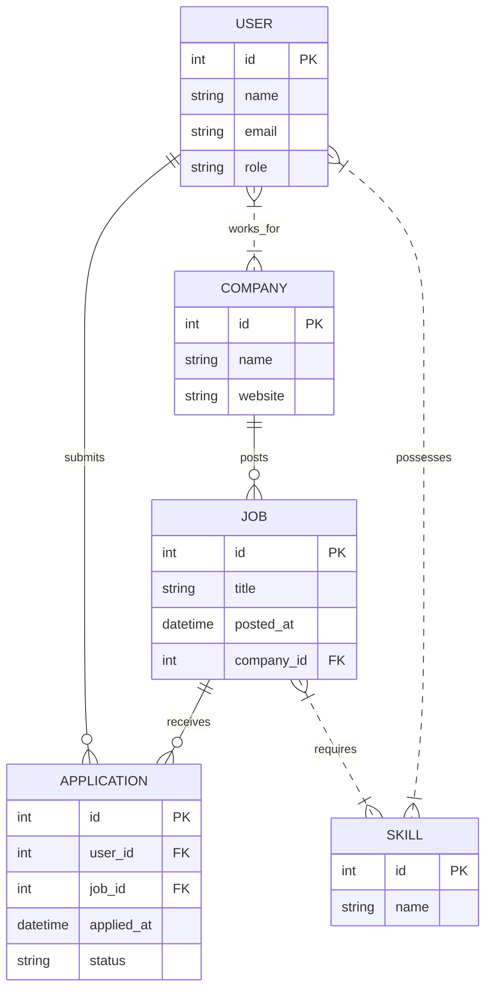
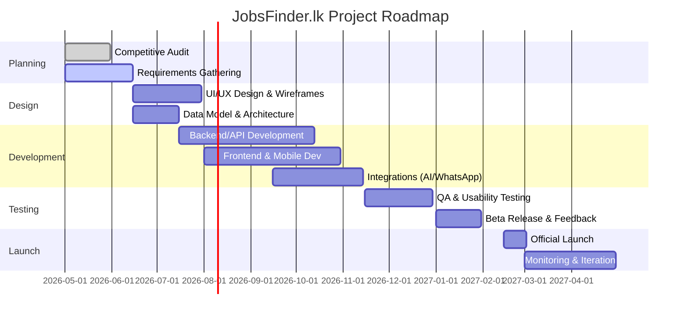

# JobsFinder.lk Project Launch Plan

## Executive Summary  
JobsFinder.lk will be a comprehensive Sri Lankan job portal addressing the needs of job seekers (students, fresh graduates, mid-career professionals), employers (SMEs and large firms), universities, the government, and advertisers. It will differentiate through advanced matching algorithms, full trilingual support (Sinhala/Tamil/English), mobile-first UX, and trust features. The platform’s MVP will include core job-posting, search/filtering, user accounts, one-click apply, and basic admin/moderation. Post-MVP features will add AI-driven matching and CV scoring, ATS tools, analytics dashboards, and integrations (e.g. WhatsApp alerts). We will monetize via paid job listings, premium placements, subscription tiers, and resume database access. The go-to-market will leverage university and agency partnerships, social media and campus drives, and verified badges for trust. A PDPA-compliant admin panel and content-moderation workflow will ensure safety and legal compliance. The project timeline spans ~12–18 months from planning to launch, with milestones and a detailed Gantt chart below.

## Competitive Audit

### Local Job Platforms  
- **TopJobs.lk (Genesiis Software)** – Sri Lanka’s original portal (launched 2006). It offers *unlimited 24/7 vacancy advertising* (on subscription) and a searchable candidate database【6†L53-L62】. Employers must submit ads via email or call (the site itself has a simple UI)【38†L99-L107】. Features include candidate matching by skill/experience, interview scheduling, candidate ranking and PDF generation【6†L53-L62】. A 2019 case study notes TopJobs “gets the job done” but has an outdated interface and requires manual ad submission (emails/bank deposits)【38†L99-L107】. **UX:** Very basic, text-heavy design; no modern filters (aside from keyword), no built-in application tracking.  
- **JobPage.lk** – Modern portal targeting government, private, foreign, and internship sectors【12†L25-L32】. The homepage highlights “Government, Private, Foreign, Internships” and claims **500,000+ professionals and 10,000+ employers** on the site【12†L25-L32】. The site features robust filters (by sector, location, job type, experience, salary) on its job search page【13†L38-L47】. **UX:** Clean and categorized (e.g. separate Govt/Private/Intern), with intuitive filters (location, employment type, salary)【13†L38-L47】. Jobs can be browsed and employers listed (though listings appear to be dynamically loaded). Payment/fee info is not obvious – likely free basic postings with paid promotions.  
- **Recruiter.lk** – Free platform focused on instant matching. Emphasizes *100% free registration and job posting*【21†L24-L28】. Uses an AI-driven match engine: jobs are automatically compared to candidate profiles by category, skills, qualifications, and even personality【21†L24-L28】. Employers only pay to unlock candidate contact info. Its home page highlights *“One-click intelligent matching”* and free postings【20†L39-L44】. **UX:** Modern, industry-category-based navigation, with “Jobs by Industry” tiles. Claim to list matched candidates instantly. Includes direct messaging. 100% no-cost model differentiates it from rivals【21†L24-L28】.  
- **DreamJobs.lk** – Free portal with a large candidate base (~300K)【25†L208-L214】. Supports all job types (express, part-time, government, overseas). Offers *automated job alerts*, employer-friendly ATS features, and partnerships (Everjobs, Owl.lk) to expand reach【25†L208-L214】. **UX:** Likely web/mobile with resume upload and alerts. Free for seekers; employers use credits or packages.  
- **XpressJobs** – Tech-forward, mobile-first platform (650,000+ users, 8,000+ employers)【25†L230-L235】. Key features: *personalized job matching*, CV-less applications (apply with profile), draft applications, and *video job ads*【25†L230-L235】. Offers robust SaaS tools like an ATS and analytics dashboard. Notably **trilingual UI** (Sinhala/Tamil/English)【25†L230-L235】. **UX:** Modern app-like design, strong filters, one-click apply, notification-driven. Integrates SMS/WhatsApp alerts.  
- **Careers360.lk** – Data-powered recruitment software. Includes smart application tracking, candidate “Eyeballing” (headhunting) tool, automated notifications, a free résumé builder, and analytics reports【25†L252-L256】. Positions itself as a transparent, efficient platform for modern recruiters【25†L252-L256】. Likely targets SME/enterprise clients needing an ATS.  
- **Other Local Portals:** The Sri Lankan market also has niche boards (e.g. ITPro.lk for tech jobs, ObserverJobs.lk by Lake House with free postings for government/private categories, IkmanJobs.lk integrated into ikman.lk classifieds【25†L273-L277】, and Jobpal.lk – a free job directory with SMS/email alerts and social media promotion【25†L295-L300】). These vary in scale but underscore the competitive landscape: most offer free or low-cost postings and cover multiple languages/types.

### International Leaders (6–8)  
- **LinkedIn** – World’s #1 professional network. ~565M monthly visits【30†L489-L496】. Jobs on LinkedIn leverage rich profiles, networking, and referrals. Features include company pages, networking-based referrals, skill endorsements, and company reviews. Offers *free* basic job posts (boosted via company networks) and paid premium postings (daily budgets starting ~$7/day or “Job Slots” packages【29†L0-L3】). LinkedIn excels in *networking/social engagement* alongside recruitment【30†L489-L496】.  
- **Indeed** – Global #1 job search engine (“27 hires per minute” claimed) with 565M visits/month【33†L523-L529】. It aggregates millions of listings from all sectors. Key features: keyword search with filters (location, salary, remote, etc.), company ratings, salary estimates, and a resume database. Indeed allows *free* job postings (up to 3 per month) but uses sponsored listings for higher visibility【27†L181-L189】. Pros: massive inventory, company reviews, simple design【33†L523-L529】. Cons: limited filtering (no company size filters) and listing saturation.  
- **Glassdoor** – Focuses on company insights: anonymous reviews and salary data【33†L561-L569】. ~22M visits/month【33†L571-L579】. Offers job listings (via Indeed integration) but its core value is *“inside” info* – Glassdoor has tens of thousands of company reviews and salaries (e.g. Microsoft has 53K reviews)【33†L561-L569】. Employers pay to post jobs, but seekers use it free. Glassdoor’s strength is salary transparency and employer branding【33†L561-L569】.  
- **ZipRecruiter** – US-based aggregator (30M visits/month【33†L663-L671】). Known for a top-rated mobile app (consistently #1 rated)【33†L672-L680】. Users get job suggestions under a “For You” tab and can “Quick Apply” via mobile. Employers can push listings to 100+ sites. It’s free for seekers; employers pay (subscription or pay-per-job). ZipRecruiter’s AI curates matches and sends alerts. Its app and notifications features are standout【33†L672-L680】.  
- **Seek** – Australia/New Zealand’s dominant job board. ~26M visits/month【35†L27-L30】. No free posting option (pricing is variable by role/location【35†L42-L50】). Features an extensive resume database, in-app messaging to passive candidates, and employer analytics【35†L49-L57】. Seek is highly localized (career advice, videos) and integrated regionally. It is widely regarded as the “go-to” site for employers in AU/NZ【35†L49-L57】 (though some complain about fake ads and poor categorization in reviews).  
- **Monster** – Legacy global job board. Offers promoted job postings (Monster+ Standard from $8/day PPC【57†L47-L55】) and monthly subscriptions (Monster+ Pro at $299/mo includes resume search)【57†L69-L77】. Integrates with CareerBuilder network. Key features: resume search (charges per resume view), employer dashboards, and branded career pages. Monster targets mid-size to large employers needing broad reach and resume mining【57†L47-L55】【57†L69-L77】.  
- **Others Considered:** (Beyond the requested list, others like CareerBuilder, Jooble, Bayt, etc. exist globally. However, the above cover main best-practices and feature-set benchmarks.)

### Feature Matrix (Local vs International)  
| Feature / Site      | TopJobs.lk           | JobPage.lk         | Recruiter.lk        | XpressJobs        | LinkedIn          | Indeed            | Glassdoor         | ZipRecruiter      | Seek              | Monster           |
|---------------------|----------------------|--------------------|---------------------|-------------------|-------------------|-------------------|-------------------|-------------------|-------------------|-------------------|
| **Job Posting**     | Unlimited on-demand (email/portal)【6†L53-L62】 | Online posting (govt/foreign categories) | Free postings【21†L24-L28】 | Online postings (free+ upgrades) | Free & sponsored posts | Free* /Sponsored | Paid/Company listings | Subscription or PPC | Paid only         | PPC ($8/day)/Sub【57†L47-L55】 |
| **Search & Filters**| Simple keyword search; no advanced UI (basic categories)【38†L99-L107】 | Multi-faceted (type, loc, experience, salary)【13†L38-L47】 | Category/keyword search; matching engine | Advanced (personalized, skills match) | Keyword + network filters | Robust keyword search; location/salary/remote filters | Job search + company filters | Keyword search + AI suggestions | Keyword search + basic filters | Keyword search + simple filters |
| **Candidate Database** | Yes – searchable CV database【6†L53-L62】  | Unclear (likely resume bank) | Yes (free CV registry)【21†L24-L28】 | Yes (profiles with skills) | Yes (profiles network) | Yes (resume DB) | No (focus on reviews) | Yes (resumes attached) | Yes (resume search) | Yes (resume DB, pay per view) |
| **Matching / AI**    | No (manual matching via search) | No (basic alerts) | Yes – instant algorithmic matching【21†L24-L28】 | Yes – AI for personalization | Recommendations via network/AI | Smart sorting; sponsored boost | No (only salary data) | AI-powered suggestions | No (human categorization) | Limited (resume search) |
| **Mobile App**      | Website only (responsive) | Website (responsive) | Responsive web | Mobile-first web/app | Android/iOS app | Android/iOS app | Mobile apps | Android/iOS app (highly rated)【33†L672-L680】 | Mobile-friendly site | Mobile-friendly site |
| **Languages**       | English only        | English (some Sinhala content) | English | Sinhala/Tamil/English【25†L230-L235】 | Multilingual (70+ languages) | Multilingual | Multilingual | English/Spanish etc | English | English |
| **UX Strengths**    | Extremely fast/simply (legacy design)【38†L88-L91】 | Fresh design, sector tabs | Category-based matching UI | Sleek, modern, social media style | Professional network integration | Simplicity, job diversity | Salary & review transparency | Clean app UI, notifications | Familiar AU/NZ UI | Established brand interface |
| **Monetization**    | Subscription (by company) | Likely subscription/ads | Free postings, charge per contact | Unknown (likely ads/premium) | Premium listings, ads | Pay-per-click & spotlight jobs【27†L181-L189】 | Pay to post, employer branding | Employer subscriptions/PPC | Employer subscriptions | PPC & subscriptions【57†L47-L55】 |

*Notes:* TopJobs’ features are drawn from its official site【6†L53-L62】 and a UX analysis【38†L99-L107】. International site data comes from company docs and reviews【33†L523-L529】【57†L47-L55】. 

## Stakeholders, Needs & KPIs  

- **Job Seekers (by segment):**  
  - *Needs:* Quick access to relevant jobs, easy application (one-click/CV upload), job alerts, salary info, career guidance, trust (no scams). Multilingual support is crucial in Sri Lanka. Mobile-friendly experience and WhatsApp alerts meet on-the-go usage.  
  - *KPIs:* Active job seeker count, applications per user, time-on-site, fill rate per listing, user satisfaction.  
  - *Priority Features:* Robust search with advanced filters【13†L38-L47】, personalized recommendations, mobile-first UI, one-click apply, resume builder, salary insights (via Glassdoor-like data), language toggle (Sinhala/Tamil/English)【25†L230-L235】, scam detection (blocked listings).  

- **Recruiters/SMEs:**  
  - *Needs:* Large pool of qualified candidates, cost-effective postings, efficient candidate search, applicant tracking, ease of communication. SMEs value free or low-cost postings (as per Recruiter.lk’s free model【21†L24-L28】) and simple UIs.  
  - *KPIs:* Number of jobs posted, time-to-hire, cost-per-hire, application-to-hire ratio, ROI on postings.  
  - *Priority Features:* Intelligent matching (to reduce screening time)【21†L24-L28】, resume database search, candidate messaging, basic analytics (views/applications per job), ATS tools (shortlisting, interview scheduling), affordable pricing tiers.  

- **Large Employers:**  
  - *Needs:* Employer branding, bulk/hiring pipeline management, integrated ATS, diversity reporting, high-touch support. Often prefer subscription packages and custom integrations.  
  - *KPIs:* Quality-of-hire, pipeline conversion rates, time-to-hire, usage of advanced features (e.g. resume search, employer analytics).  
  - *Priority Features:* Verified company pages (to signal legitimacy【56†L28-L36】), applicant tracking dashboard, multiple user accounts, scheduled postings (XML feeds), priority support.  

- **Universities/Colleges:**  
  - *Needs:* Placing graduates, managing internship programs, career fairs. Connection point to employers and students.  
  - *KPIs:* Student placement rate, number of university-affiliated jobs/internships posted, student engagement metrics.  
  - *Priority Features:* Campus recruitment sections, internship listing categories, partnerships for career guidance content, integration with university job portals.  

- **Government (Ministries/Labor Department):**  
  - *Needs:* Disseminating public sector jobs, monitoring unemployment trends, upskilling programs.  
  - *KPIs:* Public job fill rates, user sign-ups from underrepresented districts, compliance statistics.  
  - *Priority Features:* Separate portal for government vacancies, data dashboards (e.g. skill gaps, regional demand), ability to run targeted campaigns (e.g. rural job drives).  

- **Advertisers/Partners:**  
  - *Needs:* Audience reach (by segment/profession), engagement (e.g. sponsored content).  
  - *KPIs:* Impressions, click-through on ads, lead generation metrics.  
  - *Priority Features:* Banner and sponsored content slots, email newsletter ads, targeted ad campaigns (by industry/skill).  

- **Platform Admins:**  
  - *Needs:* System integrity, content quality, legal compliance.  
  - *KPIs:* Uptime, moderation throughput, user support tickets resolved, compliance (PDPA) audit results.  
  - *Priority Features:* Admin dashboard for user/job management, automated scam detection tools (e.g. flagging too-good-to-be-true jobs), moderation workflow, role-based access control, audit logs.  

(For example, job seekers highly value a “user-friendly site design”【33†L523-L529】, while Recruiter.lk’s employer pitch stresses instant candidate matching【21†L24-L28】. Our stakeholder map guides feature prioritization: e.g. advanced filters for seekers (inspired by JobPage’s design【13†L38-L47】) and AI matching for recruiters.) 

## Product Features (MVP and Roadmap)  

**MVP Features (Core Platform):**  
- **User Accounts & Profiles:** Separate roles (seeker, employer, admin). Seeker profiles include CV/resume, skills, experience, education. Employers create company profiles (with branding). All have secure login, mobile number/email verification (per PDPA【53†L40-L48】).  
- **Job Posting & Browsing:** Self-service job posting form (title, description, requirements, salary, location, etc.), with the option for multimedia (company logo, images). Employer dashboard to post, edit, track jobs. Job listings searchable by keyword and faceted filters (category, location, salary range, experience, employment type)【13†L38-L47】. “Hot Jobs” and “Featured” tagging for promotions.  
- **Search & Matching:** Keyword search with filters for seekers. Basic ranking by relevance (keywords, date). For MVP, a simple skill-based filter (match checkboxes). **One-click Apply:** Candidates apply through the portal; their profile/CV is sent to the employer automatically. Application status tracking (submitted, reviewed, interview).  
- **Multilingual UI:** All user-facing pages support **Sinhala, Tamil, and English** (language toggle). This matches XpressJobs’ trilingual support【25†L230-L235】 and is vital for national reach.  
- **Mobile & WhatsApp Integration:** Mobile-responsive design (PWA) to allow usage on phones. Job alerts and verification codes can be sent via SMS or WhatsApp (for registered users) to drive engagement. WhatsApp is widely used locally, so candidate/job alerts over WhatsApp will encourage adoption.  
- **Admin/Moderation Panel:** Admin interface for content control. Basic workflow to approve or reject posted jobs (prevent scams). Spam/scam detection (e.g. flag postings requiring payment to apply, which is a known scam pattern). User reporting mechanism.  
- **Analytics Dashboard (Basic):** For employers to view metrics: number of views, applications per posting, etc. Admin analytics (site usage, growth metrics).  

**Post-MVP (Next-phase) Features:**  
- **AI Matching & CV Scoring:** Implement advanced matching algorithms. Following industry best practices【43†L145-L153】【43†L164-L172】, use NLP/transformer models to parse resumes and job descriptions into embeddings. Calculate fit scores and rank candidates beyond keyword overlap (recognizing synonyms/skills via O*NET taxonomies)【43†L194-L202】. For example, use entity recognition to extract skills and match semantically【43†L194-L202】. Offer an “AI Recommended Jobs” list for seekers and “Smart Candidate Matches” for employers.  
- **Intelligent Search:** Semantic search so “Java developer” finds “Software Engineer, Java” etc. Autocomplete job titles/skills. Possibly integrate a recommendation engine (e.g. “Candidates you may like” for recruiters based on past hires).  
- **Advanced ATS Features:** Expand employer toolkit: one-click candidate messaging, configurable screening questions, interview scheduling, feedback forms. Multi-user employer accounts with roles (e.g. recruiter vs hiring manager). Bulk actions (e.g. email all applicants).  
- **Premium Listings & Employer Branding:** Employers can purchase “Sponsored Job” placements with visual highlights (e.g. TopJobs featured listing, newsletter shout-outs). Verified company badges (see below) on company pages and listings for trust.  
- **Verification & Trust:** Allow companies to get a “verified” badge (e.g. after KYC, tax ID verification), similar to LinkedIn’s company verification【56†L28-L36】. Verified postings can be highlighted. For job seekers, offer optional profile verification (phone/ID) to increase credibility. These badges build trust, echoing LinkedIn’s approach to “help build trust and credibility”【56†L28-L36】.  
- **Resume Database Access (Resume Bank):** Employers can search a database of applicant profiles (subject to privacy consent). Tiered access (basic limited views vs paid unlimited). Implement AI-driven candidate headhunting (like Careers360’s “Eyeballing”【25†L252-L256】).  
- **Video & Rich Media Jobs:** Enable companies to post short videos or galleries with job ads (as XpressJobs does). This increases engagement on social channels.  
- **Full Mobile Apps:** After web MVP, develop native Android/iOS apps for the portal, replicating core functionality (in line with industry leaders’ strong mobile presence).  
- **Localization:** Continuously improve language support (including formal Sinhala/Tamil job titles, right-to-left scripts if needed for Tamil, etc.) and region-specific content (local salary benchmarks, exam schedules, visa info for foreign jobs).  
- **Analytics & Reporting (Advanced):** Build out data warehouse for platform metrics. Provide employers with analytics dashboards (hiring funnel conversion, candidate demographics). Offer admin/partner dashboards with labor-market insights (e.g. skill shortages, unemployment trends).  

**Data Model (Core Entities):** The core relational schema might include **USER**, **COMPANY**, **JOB**, **APPLICATION**, and **SKILL** entities. For example:  

This ERD captures that users (seekers or recruiters) create profiles and applications, companies post jobs, and both users and jobs can be linked to multiple skills (for matching).  

**Matching Algorithms:** We will implement modern AI techniques. As noted by industry sources, today’s best-matching systems convert resumes and listings into vector embeddings via NLP and compare them with machine learning models【43†L145-L153】. Simple keyword matching is inadequate; instead, we’ll use named-entity recognition (extracting skills/titles) and map them to standardized taxonomies【43†L194-L202】. Advanced (post-MVP) approaches might use transformer models or graph neural networks to score candidate-job fit【43†L164-L172】. The algorithms will consider skill similarity, experience, and implied competencies (e.g. recognizing that “X years in healthcare analytics” implies certain skills). Matching results will be shown as candidate rankings or personalized job recommendations.

**Verification & Scam Detection:** We will build in checks to reduce fraud. For example, warn against job postings that request payment from applicants (a common scam). Companies will be vetted (e.g. verifying business registration) before posting. Flagged content (e.g. unrealistic salaries) triggers manual review. These measures build on concepts like LinkedIn’s verification to “signal official” entities【56†L28-L36】.

## Revenue Model & Pricing  

JobsFinder.lk can monetize through multiple streams (guided by industry best practices【46†L84-L92】【46†L107-L115】):

- **Paid Job Postings:** Charge employers per listing (basic posts and “featured” upgrades). For example, a single standard listing could cost $50–$200 (LKR equivalent ~15,000–60,000), with a *priority/featured* listing $100–$500 for 30–60 days【46†L84-L92】. Like many job boards, we can also offer **bulk/post packages** at discounts【46†L92-L100】. 
- **Subscription Plans:** Offer monthly/annual packages (e.g. *Small Business*, *Startup*, *Enterprise* tiers) that include a set number of posts per period【46†L107-L115】. For example, an SME plan might allow 10 posts/month for $100/month, while unlimited-posts plans ($X/month or custom) suit larger employers.  
- **Premium Features:** Upsell add-ons like access to the resume database, advanced applicant matching, or branded company profiles. For instance, resume database access could be tiered (basic access vs unlimited access【46†L141-L149】). We might charge for premium placement in newsletters or on-site banners.  
- **Advertising:** Sell display ad space (e.g. banners on job pages) and email marketing spots to training institutes, loan providers, or other relevant businesses.  
- **Analytics Services:** Offer data/analytics packages to partners (e.g. government or consulting firms) based on anonymized labor-market data.  

**Pricing Tiers (Example):** A sample pricing table could be:  

| Tier             | Posts Included       | Features                         | Price (USD)      |
|------------------|----------------------|----------------------------------|------------------|
| **Basic (Free)** | 1 free listing/month | Standard listing (expires in 30d), basic filters | $0              |
| **Standard**     | 10 posts/month       | All Basic + Featured listing, email alerts to 100 candidates | $300/year       |
| **Premium**      | Unlimited posts      | All Standard + resume database access, interview scheduling, analytics dashboard | $1,200/year     |
| **Enterprise**   | Customized           | All Premium + dedicated support, custom integration, unlimited users | $3,000–$5,000/year |

*(Prices are illustrative; actual LKR pricing and PKR conversions will be set competitively.)*  

**3-Year Revenue Projection:** Based on growth assumptions, one revenue scenario could be:  

| Year | Paid Posts (annual) | Job-Posting Rev (USD) | Subscription Rev (USD) | Advertising Rev (USD) | **Total Revenue** (USD) |
|------|---------------------|-----------------------|------------------------|-----------------------|--------------------------|
| 2026 (Year 1) | 400  | $112,000             | $5,000                | $5,000               | $122,000               |
| 2027 (Year 2) | 1,200| $336,000             | $22,500               | $15,000              | $373,500               |
| 2028 (Year 3) | 2,500| $675,000             | $60,000               | $30,000              | $765,000               |

*Assumptions:* Growing employer base and job volume (400 paid posts in Y1 rising to 2,500 by Y3). Standard posting fees ~$280 per post (avg), plus higher-tier subscriptions for power users. Ad revenue includes banner and newsletter sales. This yields a mid-six-figure revenue by Year 3. (Unit economics: initial CPA of $10–$20 per registered employer, LTV driven by repeat purchase of posting credits, as observed on other boards【46†L84-L92】【57†L47-L55】.)  

## Go-to-Market Strategy  

- **Marketing & Outreach:** Launch digital campaigns (Google/Facebook ads) targeting urban job seekers and HR professionals. Leverage content marketing (blogs on career tips). Partner with campus career centers: run workshops and campus ambassador programs to sign up students. Participate in job fairs (e.g. “Touch The Peak” at universities) for visibility. Use the statistic that *LinkedIn Premium listings start at $39.99/mo【30†L489-L496】* to position JobsFinder as an affordable alternative.  
- **Partnerships:** Collaborate with universities (to list internships/recruit from students), vocational schools (to advertise courses), and large corporations (offer their careers). Engage recruitment agencies for bulk subscriptions. Coordinate with the government’s employment centers to share civil-service jobs. Form media partnerships with newspapers for cross-promotion of job campaigns.  
- **Trust & Verification:** Introduce a **Verified Badge** program: companies can apply for verification (similar to LinkedIn’s shield badge for official pages【56†L28-L36】). Verified jobs/pages will earn user trust. Display user reviews/ratings for employers to enhance transparency. Enforce policies forbidding any job ad that demands payment from applicants, addressing the common scam issue. Use AI-powered moderation to flag dubious posts early.  
- **Localization:** All content and campaigns will be fully trilingual (Sinhala/Tamil/English) to reach local audiences. Marketing materials (ads, emails) will use local languages as appropriate. For example, XpressJobs’ approach of tri-lingual support【25†L230-L235】 shows strong local engagement; JobsFinder will do likewise. Whatsapp/SMS job alerts will be available in the recipient’s chosen language.  
- **User Incentives:** Offer early-adopter benefits (e.g. free resume audit, premium listing credits) to build initial user base. Run referral programs (points for referring friends or employers).  

Trust-building measures (verified badges, clear brand identity, moderated content) will address the credibility gap that plagues many job boards. LinkedIn’s observation that verification “helps organizations build trust and credibility”【56†L28-L36】 is instructive: we will use badges and transparent review systems to achieve similar trust on JobsFinder.lk.

## Operations & Compliance  

- **Moderation Workflow:** A dedicated team (or third-party moderators) will review new listings before they go live. We will use a combination of automated filters (for known scam patterns and duplicates) and manual review for borderline cases. Community reporting tools will allow users to flag suspicious ads or abusive behavior.  
- **Admin Panel:** Build an admin console for site moderators to manage users, jobs, and reports. Include dashboards for tracking compliance (e.g. flagged content rate) and system health. Role-based access control: e.g. separate roles for content moderator, support agent, system admin.  
- **Legal & Data Protection:** Comply with Sri Lanka’s Personal Data Protection Act (No. 9 of 2022). The national DPA came into force in March 2025, following the act’s passage【53†L40-L48】. JobsFinder will implement privacy-by-design: secure data encryption, clear consent flows (candidates opt in to share resumes), and user rights (data access/deletion). A published privacy policy and regular audits will ensure adherence. For example, Sri Lanka’s DPA emphasizes that companies must “protect data to foster trust in digital services”【53†L34-L42】.  
- **Staffing:** Core team for launch (~6–8 people): 3–4 developers, 1 UI/UX designer, 1 product manager, 1 QA tester. For content moderation/customer support, plan 2–3 part-time staff initially. Estimate annual budget ranges: e.g. assuming ~$3,000/month per developer (local rates) and ~$2,000/month for other roles, a 12-month development run might cost on the order of $200K–$300K. (Exact costs will depend on hiring/location; these are open assumptions.)  

## UX/UI Strategy  

Based on competitor analysis, we will prioritize a clean, mobile-first interface with powerful search:

- **Faceted Filtering:** Implement filters for job type, location, salary, experience, etc., as seen on JobPage【13†L38-L47】. These should be prominent on search pages.  
- **Intuitive Navigation:** Avoid clutter like TopJobs’ legacy all-jobs list【38†L88-L91】. Use categories and tabs (e.g. Government, Private, Foreign) as JobPage does【12†L25-L32】. Keep the core flow (search → results → job detail) streamlined.  
- **Mobile-First:** Given that XpressJobs sees 4.5M monthly visitors via mobile【25†L230-L235】, our design will scale down gracefully to phones. Large buttons, swipeable carousels for featured jobs, and a WhatsApp/Push notification interface will ensure engagement on small screens.  
- **Accessibility:** High-contrast text, resizable fonts, and ARIA labels will make the site accessible. Keyboard navigation and screen-reader support will be included.  
- **Enhanced UX Over TopJobs:** We will address TopJobs’ pain points【38†L99-L107】 by enabling in-app posting (no email needed) and allowing multiple job tabs rather than replacing content on the same page. Auto-saved application drafts and inline hints (salary tips, pop-up guides) will improve usability. A feedback system (e.g. star-ratings on listings) adds social proof and helps seekers.  
- **Performance:** Quick load times even on mobile (caching, CDN) will be a priority – TopJobs is fast (text-based)【38†L88-L91】, so we will match that speed with modern tech (CDN, lazy loading).  

## Risks and Mitigation  

- **Market Competition:** Established portals (TopJobs, JobPage, XpressJobs) dominate user mindshare. *Mitigation:* Differentiation via AI matching, mobile UX, and trilingual support. Aggressive marketing and partnerships to carve niche segments (e.g. internships, rural jobs).  
- **Trust & Scams:** Fake job ads could erode confidence. *Mitigation:* Verification badges for legitimate companies【56†L28-L36】, active moderation, transparent user reviews. Rapid response to flagged scams, and public trust signals (e.g. “verified” indicators).  
- **Data Privacy Compliance:** Failure to comply with PDPA carries legal risk. *Mitigation:* Early legal consulting, strict consent forms, encryption, and regular DPA (Sri Lanka) audits. Use best practices from GDPR-like regimes.  
- **Technology:** Complex AI features may face bias or errors【43†L164-L172】. *Mitigation:* Start with simple keyword matching, then iterate with gradual AI enhancements, continuously monitor fairness/bias, and provide manual override. Scalable architecture (cloud-based) to handle growth.  
- **Funding/Budget:** Underestimating costs can derail the project. *Mitigation:* Build a detailed budget with contingency; prioritize features (MVP first) so critical functions launch early even if funding is tight. Seek early partnerships or seed funding if necessary.  

## Deliverables, Timeline and Resources  

A high-level Gantt chart (below) outlines the project phases. Key milestones include completing the competitive analysis, launching the MVP, and rolling out the public launch.

**Resources & Budget:**  Core team (~6 FTE): 3 developers, 1 designer, 1 QA, 1 product manager. Plus 2–3 part-time moderators. Assuming local Sri Lankan rates (~LKR 150K/month per developer, etc.), the 12–18 month project might require on the order of LKR 50–100 million (~$150K–$300K) in staffing costs. Infrastructure (cloud hosting, SMS/WhatsApp APIs, SSL, etc.) might add ~$10K–$20K. These estimates are provisional; final numbers will depend on hiring (onshore vs offshore), marketing spend, and feature scope. 

All timelines and budgets assume focused execution; any delays (e.g. in funding or approvals) would extend the schedule. 

**Conclusion:** This comprehensive plan covers competitive insights, stakeholder needs, product scope, revenue strategy, and launch logistics for JobsFinder.lk. By learning from local incumbents and international leaders (e.g. Indeed’s freemium posts【27†L181-L189】, LinkedIn’s premium network, and Monster’s pricing models【57†L47-L55】) and by adding Sri Lanka-specific localization and trust measures, JobsFinder.lk aims to capture a loyal user base and sustainably grow into a leading employment platform in the region.  

**Sources:** Company sites and industry reports have informed this analysis【6†L53-L62】【12†L25-L32】【21†L24-L28】【25†L230-L235】【33†L523-L529】【35†L49-L57】【46†L84-L92】【53†L40-L48】【56†L28-L36】. Each source is cited above in context.